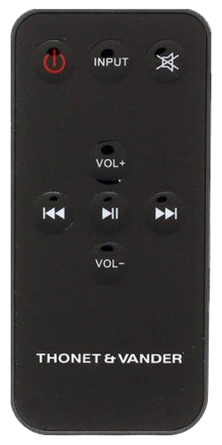
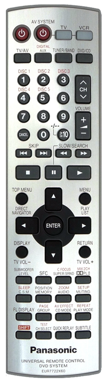

# Information
Pulses collected via IR module VS1838B connected to Raspberry Pi 3B+

# List of Remotes
<table>
  <tbody>
  <tr>
    <td align="center"></td>
    <td valign="center">
      <b>For</b>: <a href="https://google.com/search?q=Thonet and Vander Dass BT">Thonet and Vander Dass BT</a> 
      <b>Name</b>: <a href="https://www.geeetech.com/wiki/index.php/Arduino_IR_Remote_Control">Arduino IR Remote Control</a>? 
      <b>Get</b>: <a href="./remotes/thonet_and_vander_dass_bt.xml">thonet_and_vander_dass_bt.xml</a>
    </td>
  </tr>
  <tr>
    <td align="center"></td>
    <td valign="center">
      <b>For</b>: <a href="https://google.com/search?q=Panasonic SA-HT928">Panasonic SA-HT928</a> 
      <b>Name</b>: <a href="https://google.com/search?q=EUR7722X60">EUR7722X60</a> 
      <b>Get</b>: <a href="./remotes/panasonic_sa-ht928.xml">panasonic_sa-ht928.xml</a>
    </td>
  </tr>
  </tbody>
</table>
